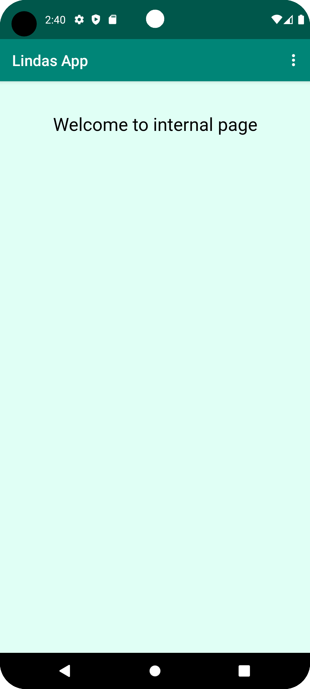
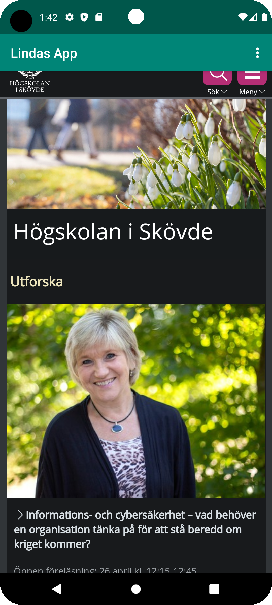
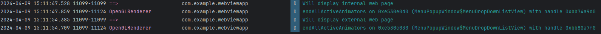

# Rapport

Namnet av appen ändrades, detta gjordes i filen "strings.xml": 
```
<string name="app_name">Lindas App</string>
```

Internetåtkomst aktiverades i filen "AndriodManifest.xml" med följande kod:
```
<uses-permission android:name="android.permission.INTERNET" />
```

WebView element skapdes i filen "activity_main.xml" med id "my_webview" med följande kod:
```
<WebView
        android:id="@+id/my_webview"
        android:layout_width="match_parent"
        android:layout_height="match_parent" />
```

Skapade en member variabel med namnet "myWebView" av typen "WebView". Sedan används "findViewById()" som är kopplad till WebView ID:
```

        myWebView = (WebView) findViewById(R.id.my_webview);

        myWebView.setWebViewClient(new WebViewClient());
```

Aktivera Javascript i WebViewClient.
```
        WebSettings webSettings = myWebView.getSettings();
        webSettings.setJavaScriptEnabled(true);
```

Lägg till länken till External och Internal Web page i koden:
```
   private WebView myWebView;
    public void showExternalWebPage(){
        myWebView.loadUrl("https://www.his.se");
    }

    public void showInternalWebPage(){
        myWebView.loadUrl("file:///android_asset/index.html");
    }
```

Lägg till valet av External och Internal Web page i dropdown menyn:

```
    @Override
    public boolean onOptionsItemSelected(MenuItem item) {
        int id = item.getItemId();

        //noinspection SimplifiableIfStatement
        if (id == R.id.action_external_web) {
            Log.d("==>","Will display external web page");
            showExternalWebPage();
            return true;
        }

        if (id == R.id.action_internal_web) {
            Log.d("==>","Will display internal web page");
            showInternalWebPage();
            return true;
        }

        return super.onOptionsItemSelected(item);
    }
}
```

Bilder:
Internal:


External:


Aktivitet i Logcat:


